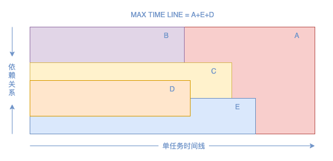

# xdepend
解决多任务并发过程中，任务间相互数据依赖问题带来的代码复杂度问题。


## 如何使用
[例子 xdepend_test.go](https://github.com/zeuszhao-hub/xdepend/blob/main/xdepend_test.go)

## 伪代码
```text
// 依赖关系
A->B,C,D,E
B
C->D
D
E->D

// 实体业务逻辑代码
a := NewService().Handle(func())
b := NewService().Handle(func())
c := NewService().Handle(func())
d := NewService().Handle(func())
e := NewService().Handle(func())

// 依赖描述，a依赖于b、c，b独立，c独立
err := NewDepend().AddDescribe(a, b, c, d, e)
                  .AddDescribe(b)
                  .AddDescribe(c,d)
                  .AddDescribe(d)
                  .AddDescribe(e,d)
                .Do(context.TODO())

// 执行时间 = a+e+d
```

## 如何安装

```shell
go get github.com/zeuszhao-hub/xdepend
```
